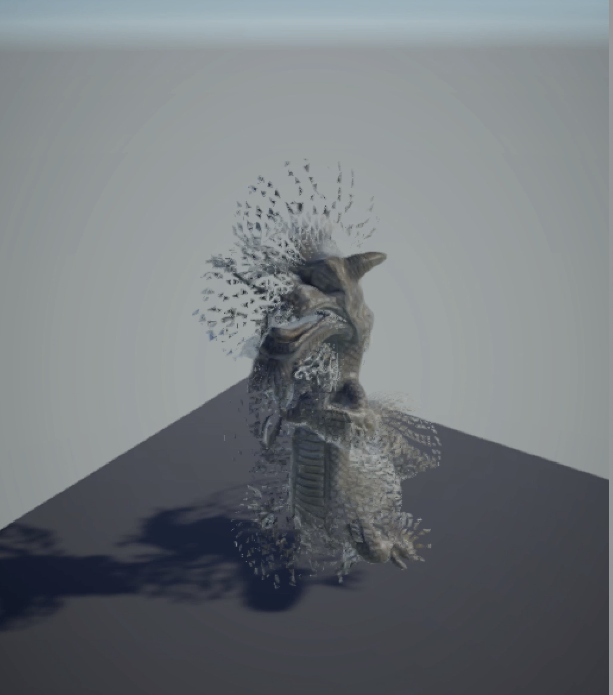

# Vertex Explosion effect (proof of concept)

This is a simple shadergraph experiment on exploding a mesh in a vertex shader. 
Interesting files:
- ShaderGraphs/vertex_explode.shadergraph - the actual shadergraph
- Editor/ExplodeMeshPostprocessor.cs - "unweld" all the shared vertices to allow for individual replacement of the faces/triangles. Current implementation affects all meshes. 

Dragon model kindly borrowed for the Fountainbleau Demo.
https://github.com/Unity-Technologies/FontainebleauDemo